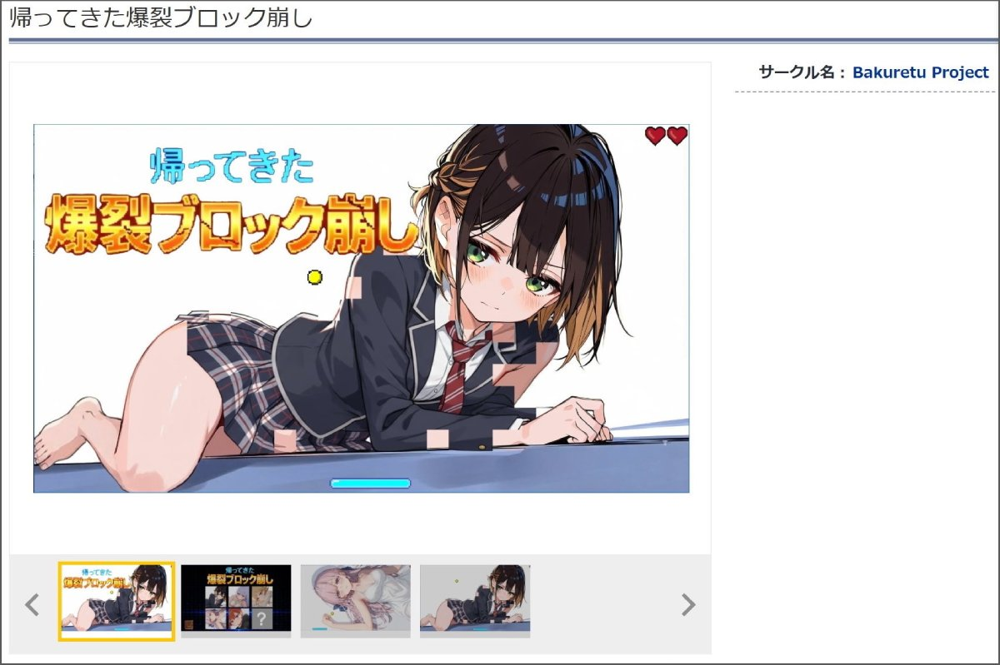
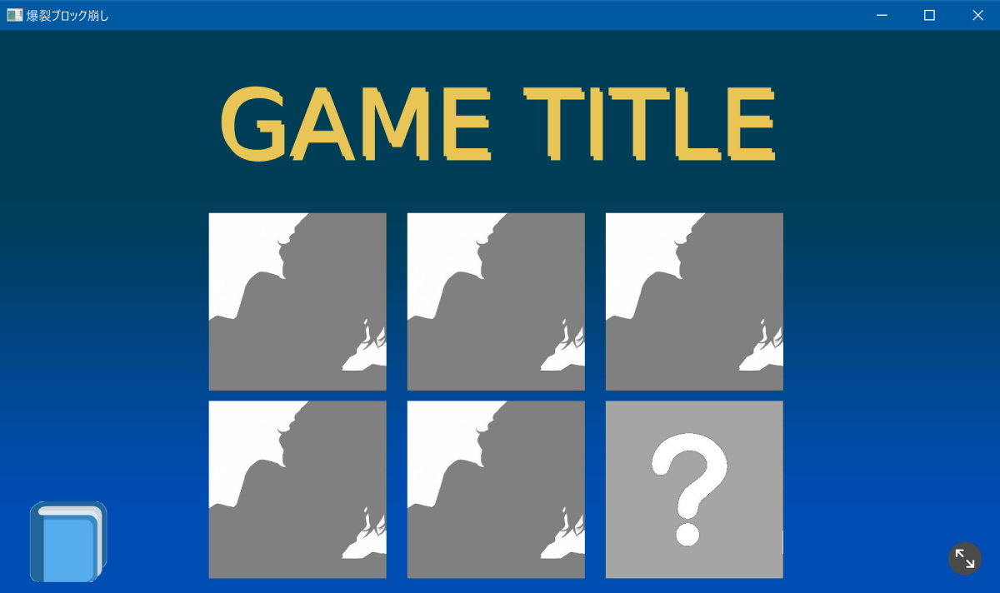
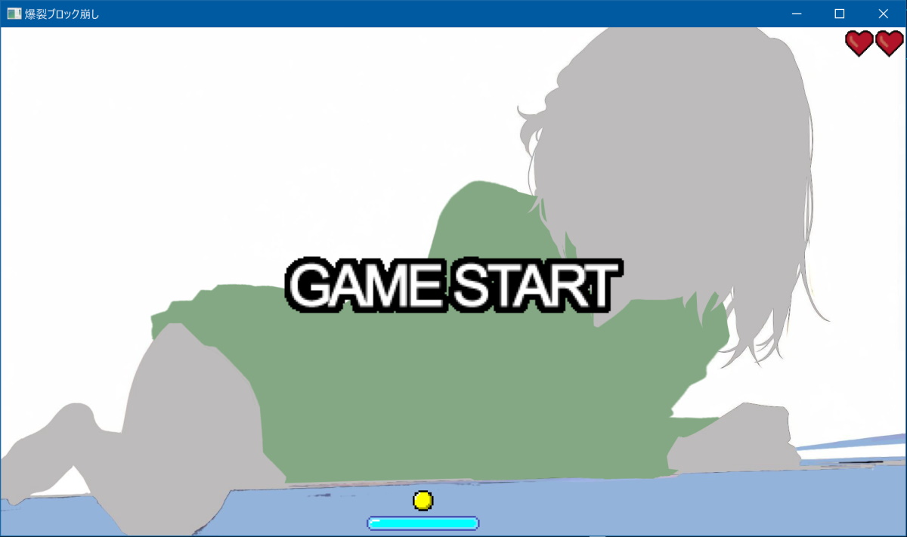
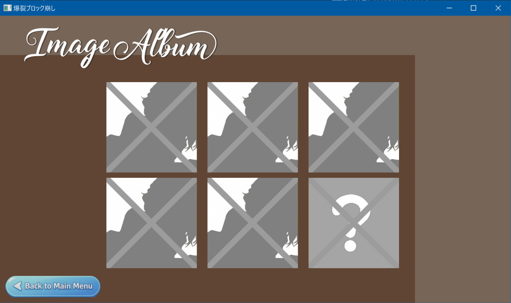

# 脱衣ブロック崩し ゲームプログラム

「脱衣ブロック崩しゲーム」のプログラムです。

プログラムと内容物は MITライセンス です。<br />
これを使って自由にブロック崩しゲーム制作ができます。<br />
開発言語は go言語、ゲームエンジンは Ebitengine を利用しています。

画像等のリソースを入れ替えてビルドする必要があるので、go言語でのビルド知識だけは必要です。<br />
プログラムを改造する場合は、go言語での開発知識が必要となります。

開発可能OS：Windows / Mac / etc<br />
(Windows / Mac 以外の開発はプログラム修正が必須です。Windows 以外は動作未検証です)

全部で6ゲームあります。<br />
プログラムを改造しないで使用する場合は、6ゲーム分のゲーム画像データの用意が必要です。

6ゲーム目はシークレットとなっていて、それ以外のゲーム全てクリアしていないと遊べないようになっています。<br />
シークレットゲームだけ、ボールの速度が少し早くなっています。

## ゲーム制作紹介ブログページ

**同人ソフトを作っちゃお！ - 爆裂健ホームページ**<br />
**[https://bakuretuken.com/dojingame](https://bakuretuken.com/dojingame)**

## 実際の同人ゲーム

**[帰ってきた爆裂ブロック崩し](https://www.dlsite.com/aix/work/=/product_id/RJ01600980.html)**<br />
【注意】リンク先は R-18 ページです
[](https://www.dlsite.com/aix/work/=/product_id/RJ01600980.html)

## ゲーム起動方法

※ go言語の開発環境が設定済みであることを前提としています。

**1. main.go の appDirNameValue、saveDataFile を設定する**

```go
// セーブデータ保存フォルダ名・ファイル名
const (
	appDirNameValue = ""
	saveDataFile    = ""
)
```

この設定は、ゲームデータを保存するフォルダ名とファイル名になります。<br />
両設定とも、半角英数字記号で指定してください。<br />
他の本ゲーム開発者とゲームデータの保存場所が被らないように、名前を指定してください。

**【推奨設定】**<br />
appDirNameValue は、サークル名や自分のドメイン名を指定してください。<br />
例）HogeHogeGames、hogehogefuga.com など

saveDataFile は、ゲームデータを保存するファイル名を指定してください。<br />
例）game_01.txt、block_game.txt など

**2. go mod tidy コマンドでパッケージをインストールする**

go.mod ファイルがあるディレクトリで実行してください。

```bash
go mod tidy
```

**3. go run コマンドでゲームを起動する**

```bash
go run .
```

## ゲーム画面

**タイトル画面**


**ゲーム画面**


**アルバム画面**


## 自作ゲームの作成方法

assets/01〜06フォルダのゲーム画像を用意して、置き換えてください。<br />
置き換える際は、画像サイズは同じにしてください。

**assets/01〜06 フォルダ**

- menu.jpg：タイトル画面メニュー（4画像）
- album.jpg：アルバム画面メニュー（4画像だが2つめの画像は未使用）
- game_back_image.jpg：ゲーム背景画像
- game_front_image.png：ゲーム前景画像（ブロック部分。透明PNG）
- lose_back_image.jpg：クリア失敗画面
- win_back_image.jpg：クリア成功画面
- game_image.jpg：アルバム表示用ゲーム画像

タイトル画面のタイトル画像を置き換えてください。<br />
置き換える際は、画像サイズは同じにしてください。

**assetsフォルダ**

- title_image.png：タイトル画面タイトル画像（2画像）

最低限、上記だけ書き換えれば、ゲームは完成です。<br />
go run コマンドで実行して動作確認ができます。

```bash
go run .
```

go build コマンドでビルドすれば、ゲーム実行ファイルが作成されます（後述）。

## Windowタイトル変更

Windowタイトルを変更する場合は、main.go の ebiten.SetWindowTitle を変更してください。
```go
ebiten.SetWindowTitle("ゲームタイトル")
```

## さらにリソースの入れ替えたい場合

下記リソースファイルを置き換えてください。<br />
画像を置き換える際は、画像サイズは同じにしてください。

【画像】<br />
- title_back_image.jpg：タイトル画面背景画像
- album_title_image.png：アルバム画面タイトル画像（透明PNG）
- album_back_image.jpg：アルバム画面背景画像
- title_album_icon.png：タイトル画面アルバム移動ボタン画像（2画像。透明PNG）
- return_menu_button.png：タイトル画面戻るボタン画像（2画像。透明PNG）

【サウンド】<br />
- title_bgm.mp3：タイトル画面BGM
- game_bgm.mp3：ゲーム画面BGM
- album_bgm.mp3：アルバム画面BGM
- game_win_bgm.mp3：ゲームクリア画面BGM

##  さらにさらにリソースの入れ替えたい場合

下記リソースファイルを置き換えてください。<br />
画像を置き換える際は、画像サイズは同じにしてください。

【効果音】<br />
- button_select_se.mp3：ボタン選択効果音
- game_block_se.mp3：ブロック破壊効果音
- game_panel_se.mp3：反射板ヒット効果音

【ゲーム部品画像】<br />
- panel_image.png：反射板画像（2画像。透明PNG）
- boll_image.png：ボール画像（2画像。透明PNG）
- start_button.png：スタートボタン画像（透明PNG）
- life_image.png：残機画像（透明PNG）
- winsow_size_button.png：ウィンドウサイズ変更ボタン画像（2画像。透明PNG）

## ビルド方法

```bash
go build .
```

Windows向け GUI版ビルド

```bash
go build -o Game.exe -ldflags="-H=windowsgui" .
```

## セーブデータの保存場所

■ Windowsの場合<br />
C:\Users\ユーザー名\AppData\Local\【appDirNameValue】\【saveDataFile】

■ Macの場合<br />
/Users/ユーザー名/Library/Application Support/【appDirNameValue】/【saveDataFile】

Windows 以外は動作未検証です。<br />
セーブデータの読み書きプログラムは appdata.go に記載されています。<br />
Windows/mac 以外でセーブデータを保存する場合は、プログラムの改修が必要です。

## アニメーション機能

※ **プログラム作者が作成した同人ゲーム[「帰ってきた爆裂ブロック崩し」](https://www.dlsite.com/aix/work/=/product_id/RJ01600980.html)では、アニメ機能は使用していません。**

「目のまばたき」などで使用できる簡易なアニメーション機能があります。<br />
プログラムの仕様上、アニメーション表示の位置は服の上になります。

アニメーションを使用したいゲームフォルダに、**game_anime_image.jpg** をおいてください。<br />
アニメ画像は同じサイズで横に並べてください。jpegフォーマットなので、画像ノイズを防ぐために縦横サイズは8の倍数がおすすめです。

**game_anime_image.jpg**<br />


設定ファイル **config.go** を編集してください。

**config.go** <br />
```go
var stageConfigs = map[string]StageConfig{
	"01": {
		BallSpeed:     9,
		AnimeSheet:    3,    // アニメーション画面数（0の場合はアニメ無し）
		AnimeInterval: 60,   // アニメーション実行間隔（フレーム）
		AnimeSpeed:    10,   // アニメーション画像切り替え間隔（フレーム）
		AnimeX:        1300, // アニメーション作画X位置
		AnimeY:        80,   // アニメーション作画Y位置
	},
・・・
```

## デバッグ機能

- タイトル画像で ctrl + Alt + Dキーでセーブ状態初期化
- タイトル画像で ctrl + Alt + Aキーでゲームクリア状態初期化

キーを押した直後はタイトル画面は更新されません。一度アルバム画面に遷移して戻ってくると更新されてます。<br />
デバッグプログラムは scene_title.go に記載されています。

## 関連リンク情報

go言語<br />
https://go.dev/

ゲームエンジン Ebitengine<br />
https://ebitengine.org/ja/

## 作者ホームページ

BakuretuKen Homepage<br />
https://bakuretuken.com/

## ライセンス

MIT License
